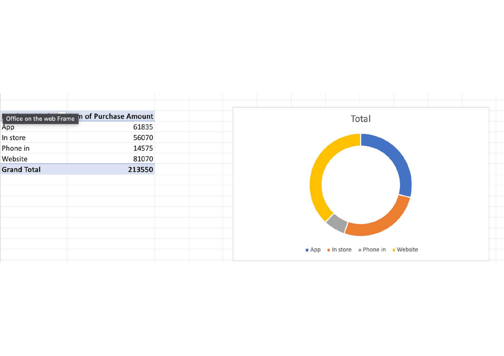

# Excel Sales Dashboard

## Project Overview
This project is an interactive Excel Sales Dashboard created using Microsoft Excel to analyze sales performance and customer purchasing trends.

## Features
- Interactive Dashboard
- Pivot Tables
- Pivot Charts
- Slicers
- Sales Analysis
- Customer Analysis
- Product Analysis

## Dashboard Preview

### Overall Dashboard

### Sales Dashboard

### Customer Dashboard

### Profit Dashboard

## Tools Used
- Microsoft Excel
- Pivot Tables
- Pivot Charts
- Slicers
- Excel Formulas

## Skills Demonstrated
- Data Cleaning
- Data Analysis
- Data Visualization
- Dashboard Design
- Business Insights

## Author
Saikrishnateja Surabhi
